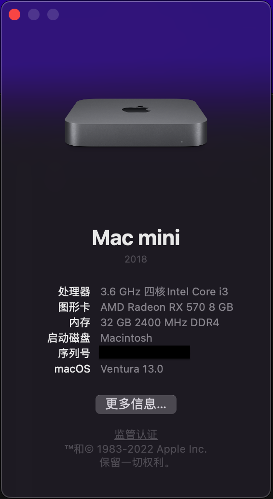
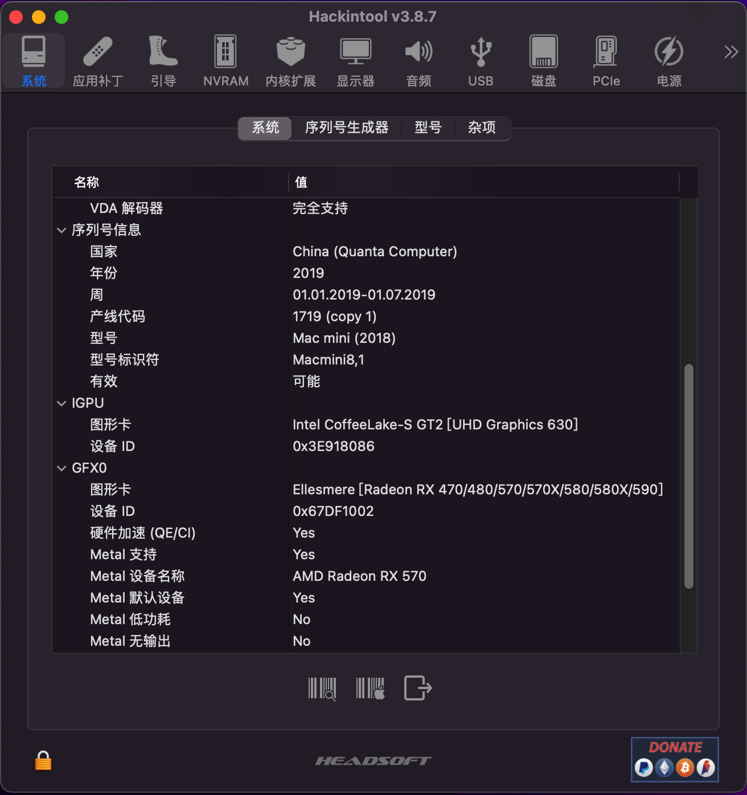
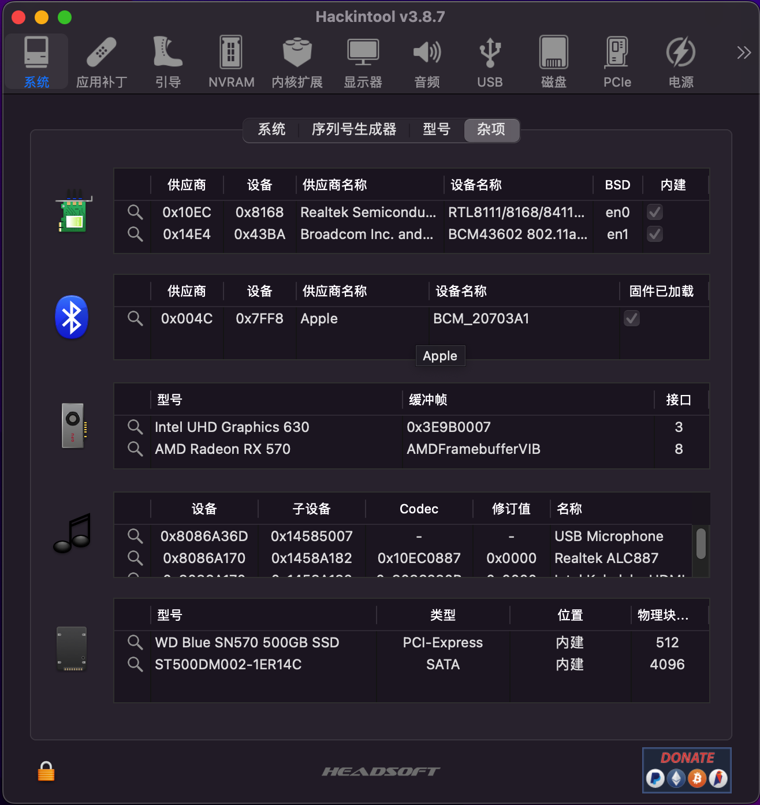
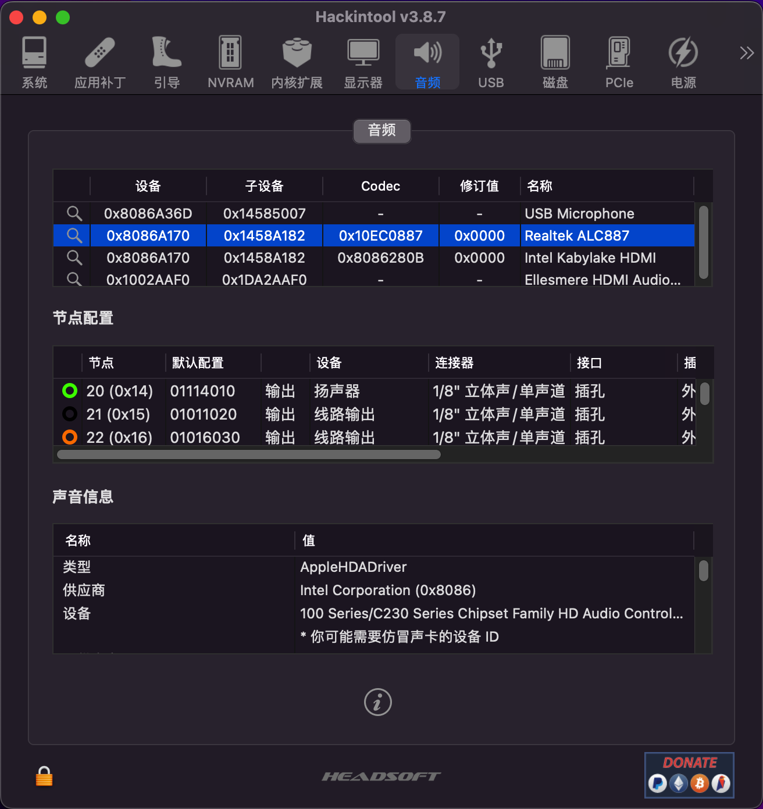
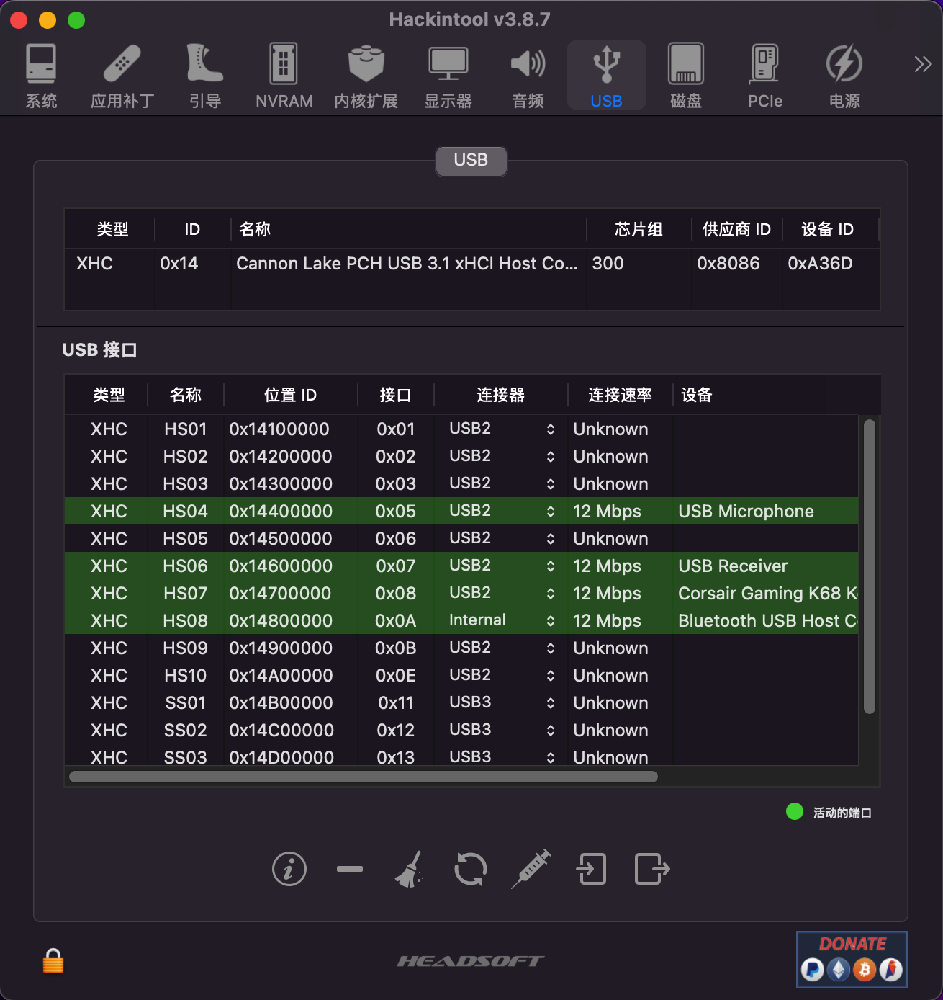
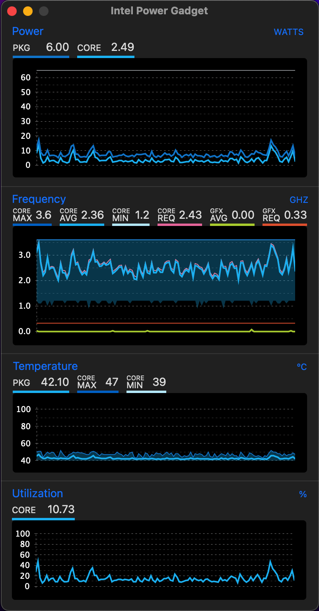

# Gigbyte B360m DS3H
- ！！！注意！！！
- 使用前请自行修改设备序列号：root > PlatformInfo > System Serial Number
- 安装前请先清除NVRAM：clearnvram 

# 配置

 macOS Ventura 13.0 with OpenCore 0.8.6

 | 组件 | 名称			|
 | ---- |-----------------------|
 | CPU  | i3-8100               |
 | 主板 | Gigbyte B360m DS3H    |
 | 显卡 | Randeon RX570         |
 | 机型 | Macmini8,1            |
 | 网卡 | 博通BCM943602CS       |

# BIOS

- 「BIOS 功能 」-「快速启动」-「关闭」
- 「BIOS 功能 」-「CSM 支持」-「关闭」
- 「BIOS 功能 」-「Security Device Support」-「Disable」
- 「集成外设」-「Software Guaed Extension （SGX）」-「关闭」
- 「集成外设」-「Super IO 配置」-「Serial Port」-「关闭」
- 「集成外设」-「Super IO 配置」-「板载 LPT 端口」-「关闭」
- 「集成外设」-「USB 程序」-「XHCI Hand-off」-「开启」
- 「集成外设」-「SATA Anf RST Configuration」-「SATA Mode Selection」-「启动」
- 「芯片组」-「VT-d」-「关闭」
- 「芯片组」-「4G 以上解码」-「启动」
- 「芯片组」-「IOAPIC 24-119 Entries」-「启动」
- 「芯片组」-「Aperture Siz」-「128MB」

# What works

- [x] All USB Ports (port mapping performed)
- [x]  All Sensors (CPU, GPU, NVME, SATA, FANS)
- [x]  SpeedStep / Sleep / Wake
- [x]  Wi-Fi and Bluetooth (Fenvi T919)
- [x] Windows 10 boot from OpenCore

# Ventura 13.0

# Graphics

# Wifi and Bluetooth

# Audio

# USB

# Intel Power Gadget

